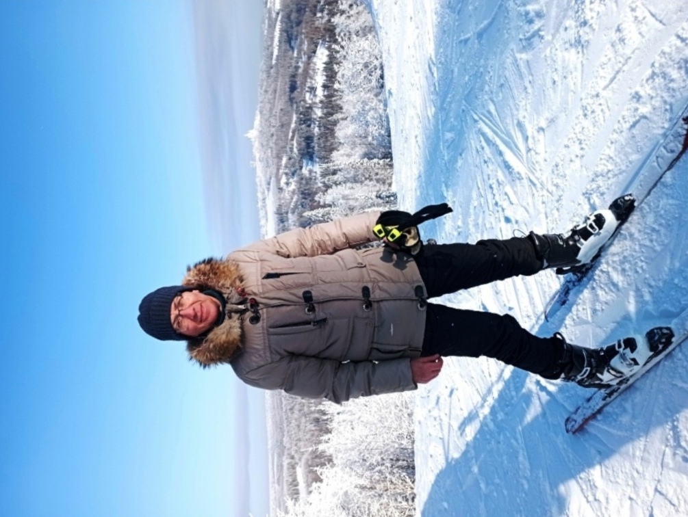

# Обо мне
**Здравствуйте!**

***Меня зовут Вадим.***

_Я обучаюсь в Нетологии по программе "Python-разработчик с нуля".
До Python был знаком только с языком Basic, да ещё когда-то имел программируемый микрокалькулятор МК-61, у которого был собственный язык программирования ЯМК-61, похожий на Ассемблер._

